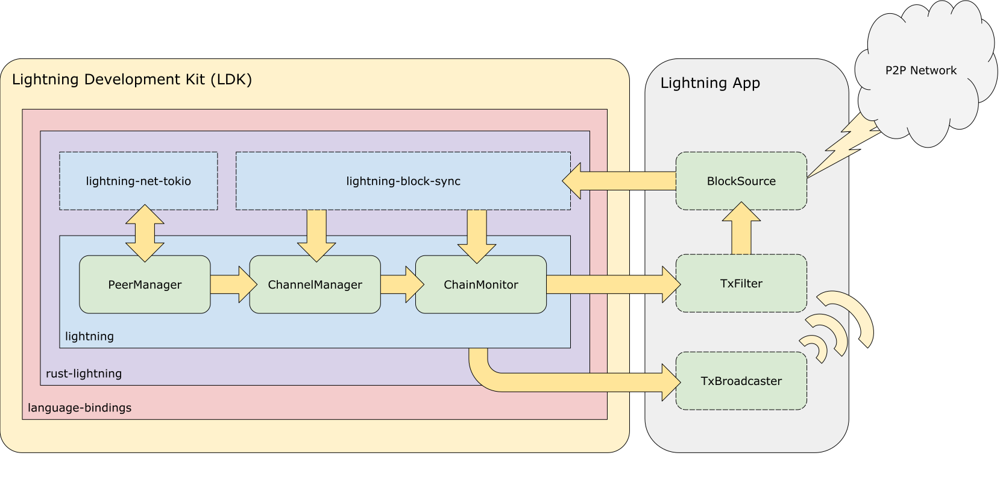

## Introduction

In this guide, we'll explore how to provide chain data to LDK upon startup and
as new blocks are mined. This allows LDK to maintain channel state and monitor
for on-chain channel activity.

LDK maintains channels with your node's peers during the course of node
operation. When a new channel is opened, the `ChannelManager` will keep track of
the channel's state and tell the `ChainMonitor` that a new channel should be
watched. The `ChainMonitor` does so by maintaining a `ChannelMonitor` for each
channel.

When a new block is mined, it is connected to the chain while other blocks may
be disconnected if reorganized out. Transactions are confirmed or unconfirmed
during this process. You are required to feed this activity to LDK which will
process it by:

* Updating channel state
* Signaling back transactions to filter
* Broadcasting transactions if necessary

We will walk through this process as depicted here:

